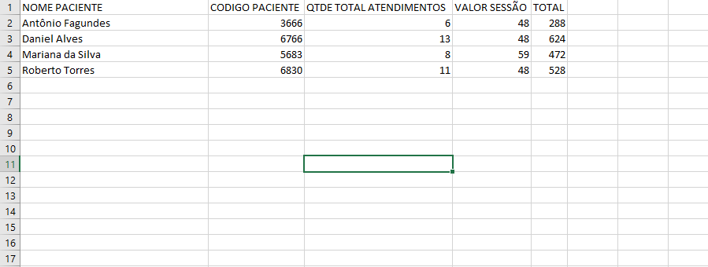
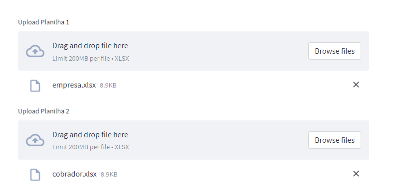
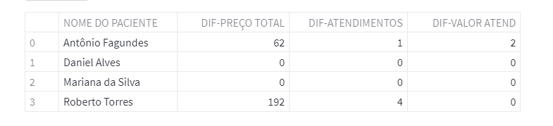

# App de análise financeira: https://financial-app24.herokuapp.com/
Essa aplicação realiza uma simples análise financeira baseada em planilhas xlsx, uma com dados financeiros de 
serviços prestados por uma hipotética empresa terceirizada e outra da empresa empregadora com dados dos mesmos 
serviços. O objetivo é chequar se os dados financeiros batem com os dados da empresa empregadora, isso é feito a partir do calcúlo da diferença, logo se o output aparecer zerado é porque os dados batem.

O agrupamento dos dados é feitos a partir dos nomes do clientes, por isso é necessário que os nomes sejam iguais em ambas as planilhas.
Dados checkados: Quantidade total de atendimentos, preço dos atendimentos e valor total.

## Planilha modelo

Exceto a coluna 'CODIGO PACIENTE', todas as colunas são necessárias e devem estar escritas exatamente da forma acima.

## Como usar
Primeiro você deve fazer upload da planilhas xlsx da empresa empregadora ( aquela que tem os dados corretos ), e em baixo em Planilha 2 você deve fazer upload da empresa terceirizada com os dados que precisam serem chequados.

Depois de clicar no botão um output como o de baixo aparecerá:

# Tecnologias
- Python
- Pandas
- Streamlit
